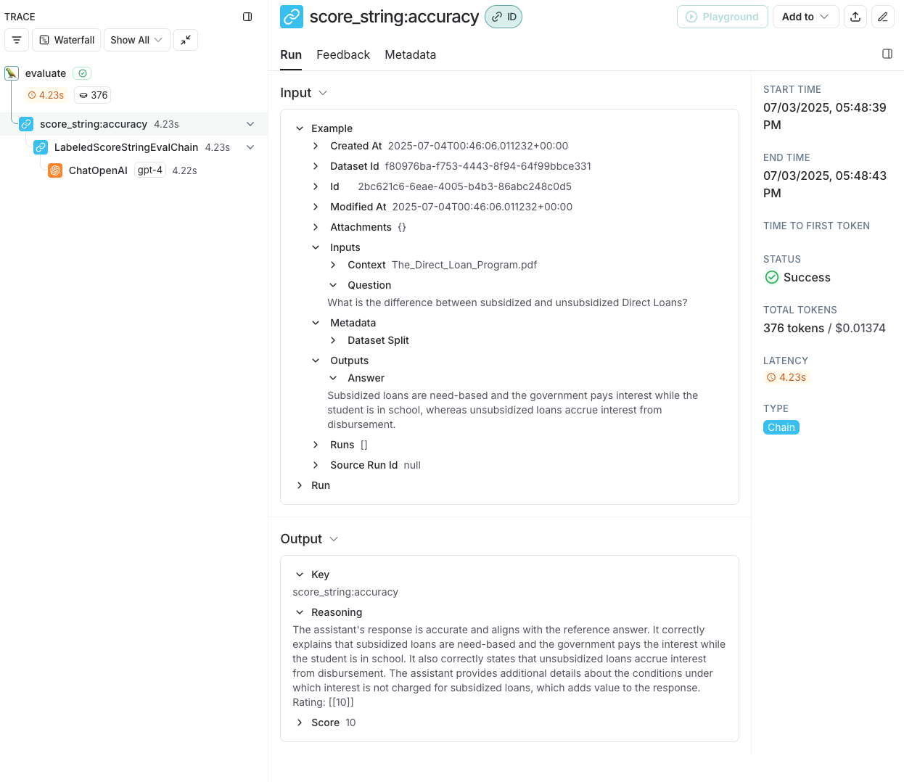

### LangGraph questions
##### ❓ Question #1:
What is the embedding dimension, given that we're using `text-embedding-3-small`?

##### ✅ Answer #1:
1536

#### ❓ Question #2:
LangGraph's graph-based approach lets us visualize and manage complex flows naturally. How could we extend our current implementation to handle edge cases? For example:
- What if the retriever finds no relevant context?  
- What if the response needs fact-checking?
Consider how you would modify the graph to handle these scenarios.

##### ✅ Answer #2:
- If the retriever finds no relevant context: we can create conditional edge after retrieve step. If no context, we can go to a new node that outputs "No relevant knoweldge found" and end the graph. If there is context, then we go to the "generate" node and output LLM reponse. 

- If the response needs fact-checking: we can add another node(fact-checking node) after generate, that will call LLM model to validate if the response is consistent with context provided, or use some external data source for validation, and output true or false. 

##### 🏗️  Activity #1: Brainstorm some ideas that would split large single documents into smaller documents.
1. document structure aware chunking : This method leverages the inherent structure of the document format (e.g., Markdown headers, HTML tags, code blocks, tables in CSV/Excel, etc.) to guide how chunks are split.
2. semantic chunking: Uses meaning and topic shifts in the content to decide where to split. It typically works by generating embeddings of sentences or paragraphs and measuring similarity between them.
3. Hierarchical Chunking: Organizes the document into a tree structure — e.g., chapters → sections → paragraphs — and allows chunking at different levels based on use case or granularity needs.

### LangSmith questions
#### ❓Question #1:

What conclusions can you draw about the above results?
Describe in your own words what the metrics are expressing.

##### ✅ Answer #1:
Based on the evaluation results from the 3 evaluators:
- cot contextual accuracy: 100% correct
- dopeness: 25% dope
- score string: 8.25 accurate 

our RAG system is 100% correct, and relatively accurate, but not very dope. 
However even the 25% dopeness is false positive due to hallucination. By examing the trace, the evaluator will give 'Y' for dopeness even if its reasoning says the opposite. 

#### 🏗️ Activity #1:

Include a screenshot of your trace and explain what it means.

- this shows the trace of invoking our langGraph rag with a user question. It shows our two nodes "retrieve" and "generate" and the inputs and output of each step.

- This shows the trace of evaluting one exmaple in the dataset, using labeled_score_string evaluator.
- It shows this evaluation takes 4.23s, and latency is mostly due to calling gpt-4 API for evaluation.
- it shows the input and output of this evaluation_chain
    - input has : user question, prediction(rag results, actual), and reference(expected answer)
    - output has: evaluation results : reasoning and a score 
- it shows the GPT evaluation input and output
    - input has : 
        - system message
        - human message: instruction, ground truth, question and assistant answer
    - output is the AI evaluator response
- it shows metadata about this run: reference example id, project_id and so on 

#### 🏗️ Activity #2:

Complete the prompt so that your RAG application answers queries based on the context provided, but *does not* answer queries if the context is unrelated to the query.

### answer: 
HUMAN_TEMPLATE = """
#CONTEXT:
{context}

QUERY:
{query}

Use the provide context to answer the provided user query. Only use the provided context to answer the query. If you do not know the answer, or if the query is unrelated to the provided context respond with "I don't know"
"""
